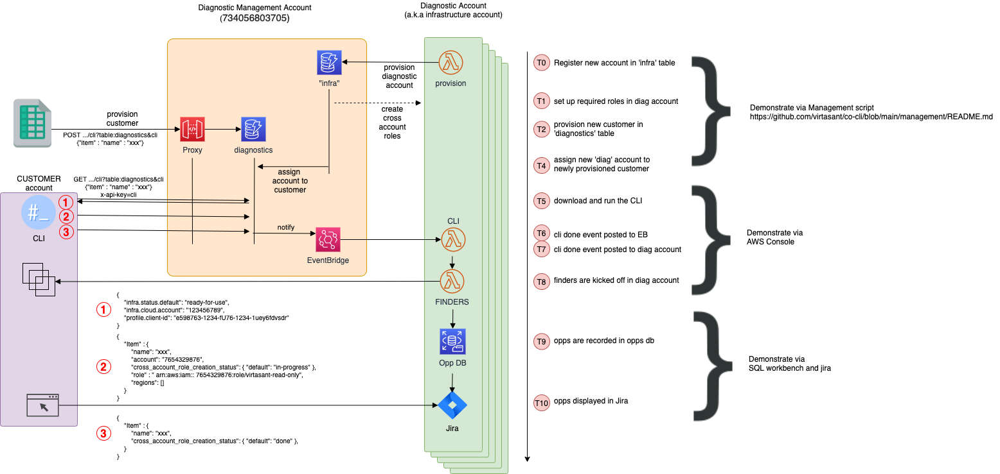

# co-cli

This is the backend implementation to support the cross account permission 
provisioning CLI tool. 

## Tech Stack

- API:
  - API Gateway
  - Lambda function Python
  - GraphQL interface
- Identity management: AWS Cognito
- Database:
  - DBMS: MySQL (Aurora MySQL)
  - Interface: SQLAlchemy declarative
  - Migrations: Alembic
- Deploy: AWS CDK

## Project structure

- `api/` - Lambda function code for the API
  - `schema/` - GraphQL definitions
  - `scripts/` - General purpose scripts that require the api python module
  - `utils/` - Functionality to support the API requests
- `email_service/` - Lambda function to handle emails
- `deploy/` - CDK deploy data

## Running unit tests

All test files are located in `tests/` directory inside each lambda service.

To run them all use:

    python3 -m unittest discover -v

## Architecture

